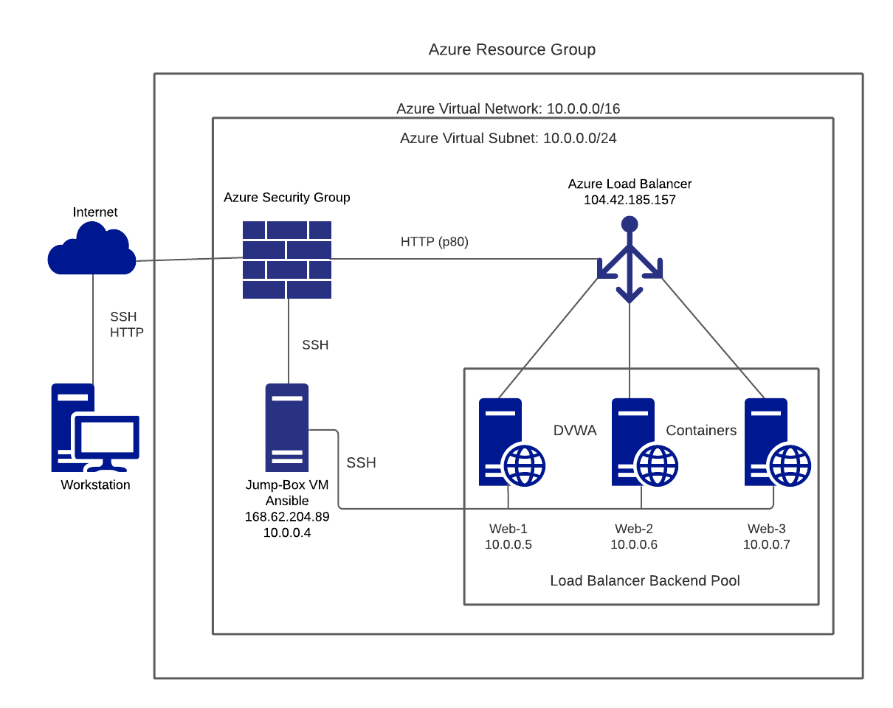

## Automated ELK Stack Deployment

The files in this repository were used to configure the network depicted below.

These files have been tested and used to generate a live ELK deployment on Azure. They can be used to either recreate the entire deployment pictured above. Alternatively, select portions of the filebeat-playbook.yml and metricbeat-playbook.yml files may be used to install only certain pieces of it, such as Filebeat.

  - [ELK Playbook File](Ansible/elk-playbook.yml)
  - [FileBeat Playbook File](Ansible/filebeat-playbook.yml)
  - [MetricBeat Playbook File](Ansible/metricbeat-playbook.yml)

This document contains the following details:
- Description of the Topology
- Access Policies
- ELK Configuration
  - Beats in Use
  - Machines Being Monitored
- How to Use the Ansible Build

### Description of the Topology

The main purpose of this network is to expose a load-balanced and monitored instance of DVWA, the D*mn Vulnerable Web Application.

Load balancing ensures that the application will be highly available, in addition to restricting traffic to the network.
- _What aspect of security do load balancers protect?_ 
Answer: load balancers protect availability (the A in CIA).
- _What is the advantage of a jump box?_
Answer: using a jump box limits the internal networks exposure to the public internet (only the jump box has an public IP).  It controls access to the other machines by allowing connctions from specific IP addresses only.

Integrating an ELK server allows users to easily monitor the vulnerable VMs for changes to the log files and system metrics.
- _What does Filebeat watch for?_
Answer: Filebeat watches for files which have changed and then logs those changes.
- _What does Metricbeat record?_
Answer: Metricbeat records system-level metrics including CPU usage, memory, file system, disk IO, and network IO statistics.  In addition, it also records stats for running processes.

The configuration details of each machine may be found below.

| Name     | Function | IP Address | Operating System |
|----------|----------|------------|------------------|
| Jump Box | Gateway  | 10.0.0.1   | Linux            |
| Web-1    | Webserver| 10.0.0.5   | Linux            |
| Web-2    | Webserver| 10.0.0.6   | Linux        |
| Web-3    | Webserver| 10.0.0.7   | Linux            |
| Elk      | Elastic Search, Logstash and Kibana| 10.1.0.4   | Linux         |

### Access Policies

The machines on the internal network are not exposed to the public Internet. 

Only the Jump Box machine can accept connections from the Internet. Access to this machine is only allowed from the following IP addresses:
- 99.231.116.134

Machines within the network can only be accessed by the ansible container within the Jump Box.
- 10.0.0.5
- 10.0.0.6
- 10.0.0.7
- 10.1.0.4

A summary of the access policies in place can be found in the table below.

| Name     | Publicly Accessible | Allowed IP Addresses |
|----------|---------------------|----------------------|
| Jump Box | Yes              | 99.231.116.134         |
| Elk      | Yes              | 99.231.116.134         |
| Web-1    | No               | 10.0.0.4, 10.1.0.4     |
| Web-2    | No               | 10.0.0.4, 10.1.0.4     |
| Web-3    | No               | 10.0.0.4, 10.1.0.4     |

### Elk Configuration

Ansible was used to automate configuration of the ELK machine. No configuration was performed manually, which is advantageous because the chance for human error is reduced.

The playbook implements the following tasks:
- Install Docker
- Install Pip
- Install Pip Docker module
- Increase virtual memory
- Download the ELK Docker container and launch it
- Enable Docker on boot

The following screenshot displays the result of running `docker ps` after successfully configuring the ELK instance.

### Target Machines & Beats
This ELK server is configured to monitor the following machines:
- 10.0.0.5
- 10.0.0.6
- 10.0.0.7

We have installed the following Beats on these machines:
- Filebeat
- Metricbeat

These Beats allow us to collect the following information from each machine:
- _TODO: In 1-2 sentences, explain what kind of data each beat collects, and provide 1 example of what you expect to see. E.g., `Winlogbeat` collects Windows logs, which we use to track user logon events, etc._

### Using the Playbook
In order to use the playbook, you will need to have an Ansible control node already configured. Assuming you have such a control node provisioned: 

SSH into the control node and follow the steps below:
- Copy the _____ file to _____.
- Update the _____ file to include...
- Run the playbook, and navigate to ____ to check that the installation worked as expected.

_TODO: Answer the following questions to fill in the blanks:_
- _Which file is the playbook? Where do you copy it?_
- _Which file do you update to make Ansible run the playbook on a specific machine? How do I specify which machine to install the ELK server on versus which to install Filebeat on?_
- _Which URL do you navigate to in order to check that the ELK server is running?

_As a **Bonus**, provide the specific commands the user will need to run to download the playbook, update the files, etc._

------------------------------------------------------------------
## Interview Questions